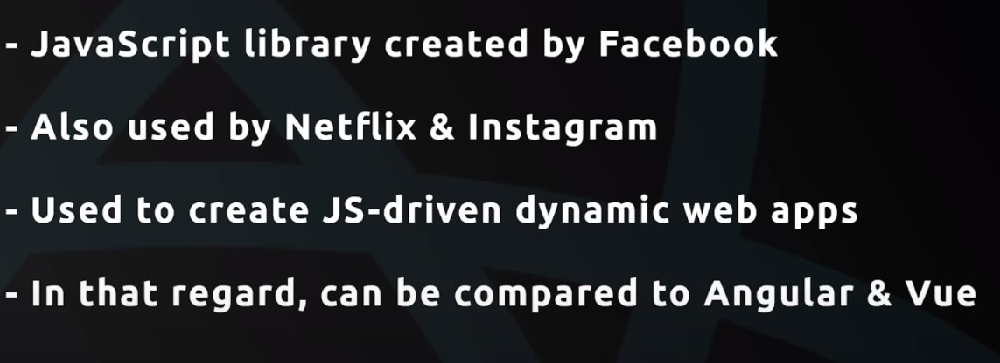
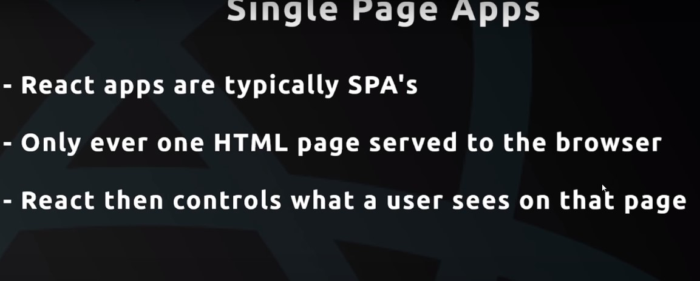
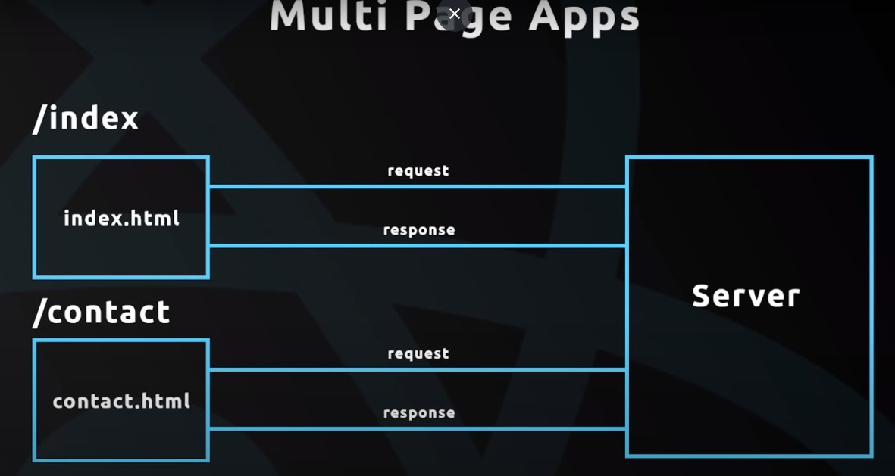
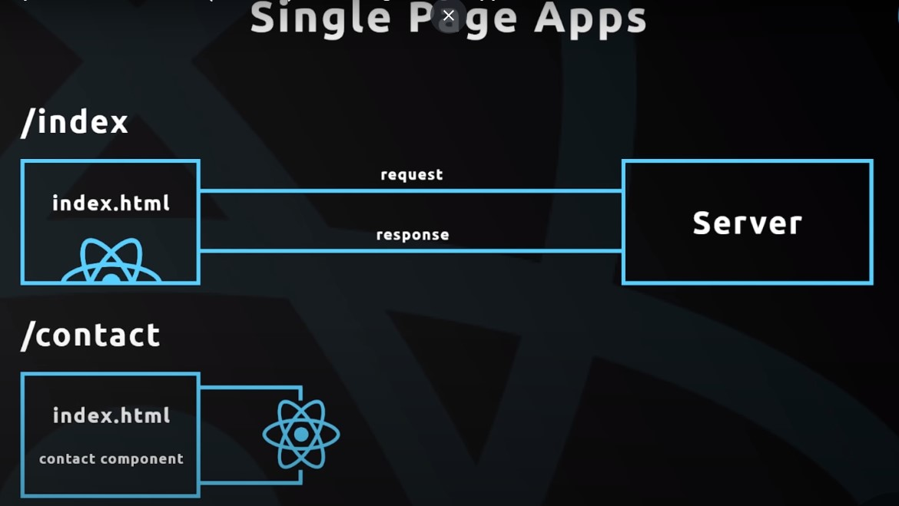
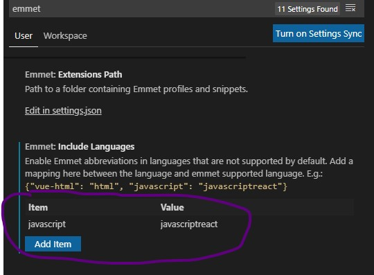
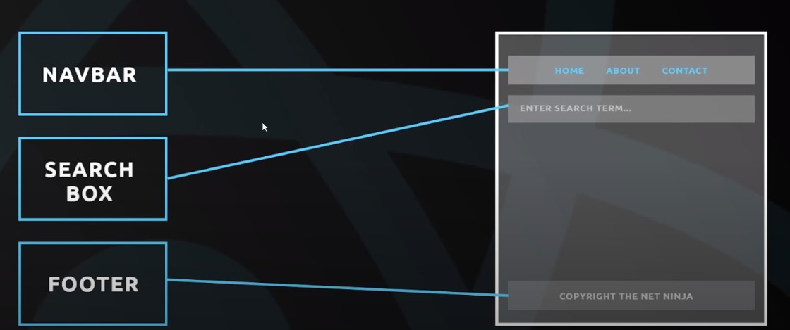
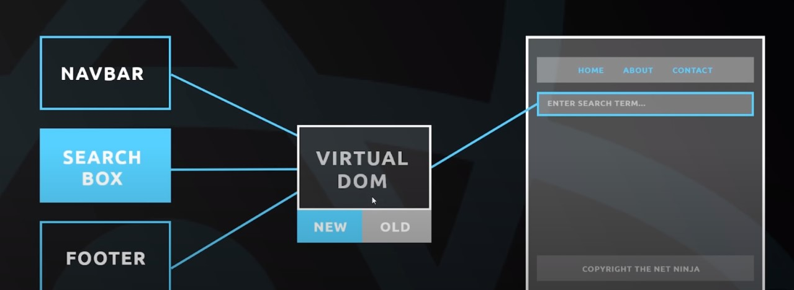
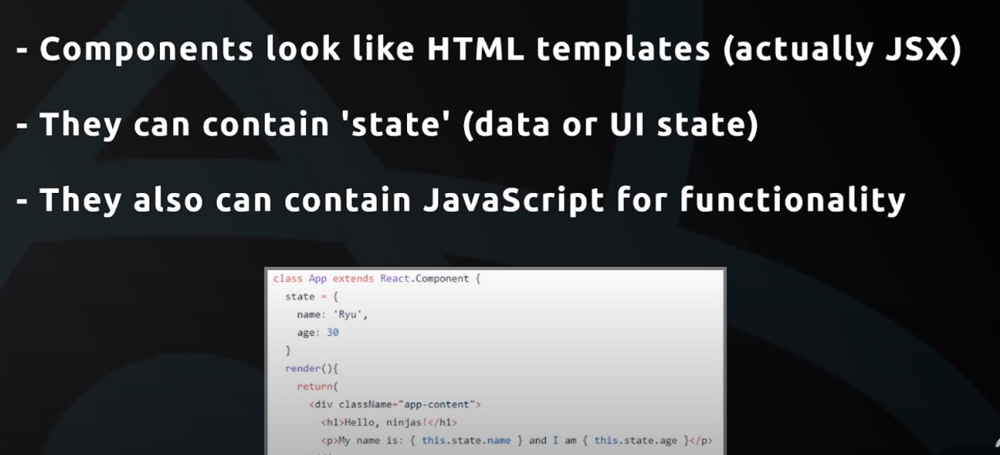

[What is React](#What-is-React)

[Single Page Apps](#Single-Page-Apps)

[Extensions to Install](#Extensions-to-Install)

[How React Works ?](#-How-React-Works)

[Create React Application](#Create-React-Application)

[File Structure Overview](#File-Structure-Overview)

[Components and Templates](#Components-and-Templates)

[Dynamic Values in Template](#Dynamic-Values-in-Template)

# What is React ?



# Single Page Apps



## What is Multi Page App

- To load to different page, v sent different request and gets the response. for
  example, to get index page v sent a request, for contact page v sent another request.



## What is Single Page App

- In SPA, user sent a request to get index page, and gets response index.html.
  once v get index page, if user clicks on a link to contact page, REACT intercepts that request from going to the server and loads the _contact component_ in the browser.



- This way React shows diff. components to the user based on their actions.

---

# Extensions to Install

1. Simple React Snippets
2. Reactjs code snippets

To use emmet inside react components, update settings like below,



---

# How React Works ?

- v create components for diff. parts of our application.
  for example, component for navbar, search box, footer...
- job of react is to take these components and inject them in to the DOM. thus v can see them on the webpage.



## how does REACT do this ?

- REACT takes all these components and create a js representation of the DOM. also called _Virtual DOM_.
- REACT take this _Virtual DOM_ and renders it to the browser. and browser then creates an actual DOM based on this _Virtual DOM_. thats how v see the components.
- every time v make a change in any of theses component, for eg; change ui state of the components, data inside this components. REACT look at that change and updates the DOM in the browser. this happens fast bcose of _Virtual DOM_.


- for every change a new Virtual DOM is created. and that new Virtual DOM is compared with old one. and it knows exaclty where to update those new changes in the DOM. so it only updates that part.



## Components and Templates



---

# Create React Application


## Creating An App

- Go thru below link

  [Creating an App](https://github.com/facebook/create-react-app)

or run below command

```terminal
npx create-react-app my-app
cd my-app
npm run start
```

Check React Version

```terminal
npm view react version
```

---

# File Structure Overview

**node_module**: where all our project dependencies resides. if _node_modules_ not present in the project that downloaded from github. v can add it by running,

```terminal
npm install
```

**public > index.html** - Initial index file served by the server. React injects the components dynamically to the div element in this file.

```html
<div id="root"></div>
```

**src > App.js** - is the App component file. v export our App component here

**src > index.js** - where v render our App component to the DOM. V import the App component here.

```js
ReactDOM.render(
  <React.StrictMode>
    <App />
  </React.StrictMode>,
  document.getElementById('root')
);
```

- index.js takes the _App_ component and renders to the DOM inside the div element with id _root_

**package.json** - List all the dependecies of the app. Also have scripts to run & build the app.

---

# Components and Templates

## App Component

**App.js**

```js
function App() {
  return (
    <div className='App'>
      <header className='App-header'>
        
        <p>
          Edit <code>src/App.js</code> and save to reload.
        </p>
        <a
          className='App-link'
          href='https://reactjs.org'
          target='_blank'
          rel='noopener noreferrer'
        >
          Learn React
        </a>
      </header>
    </div>
  );
}
```

- here code inside the return() is _JSX_ template. and not _HTML_ template.

- JSX allows to create html style templates, and in background _Babel_ transpiles this jsx templates to html. and renders that html template to DOM.

- In JSX v use _className_ in place of _class_. while transpiling to html, it got converted to _class_.

---

# Dynamic Values in Template

**App.js**

- Using curly braces to add dynamic values to the template.

```js
function App() {
  const title = 'Welcome to our blog';
  const likes = 50;
  const link = 'https://www.google.com';
  return (
    <div className='App'>
      <div className='content'>
        <h1>{title}</h1>
        <p>Liked {likes} times</p>
        <a href={link}>Google Site</a>
      </div>
    </div>
  );
}
```

---
